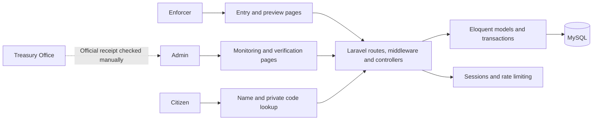

**POSO system architecture and design audit — 11 September 2026**

**Remediation update:** Implementation findings were addressed and the migration was applied to the main local database. See the [remediation report](architecture-remediation-2026-09-11.md) for changes, validation and remaining operational decisions. The findings below describe the pre-remediation system.

The current Laravel application is a suitable foundation for a municipal violation monitoring system. Its strongest parts are the separation between Admin and Enforcer responsibilities, preserved incident details, restricted citizen lookup, and transaction-based Treasury verification with correction history. Keep this architecture and improve its workflow boundaries. The findings below do not justify splitting the application into microservices.

Two findings should be addressed first: resetting a staff password does not revoke an existing session, and records with an unknown fine have no supported path to settlement. The interface is visually consistent and works at the reviewed desktop and phone widths when its dependencies load, but several screens still communicate the old payment/ticket workflow.

This review covers source code, database migrations, automated behavior, and rendered interfaces. All new test data was synthetic and used isolated in-memory SQLite databases. Browser checks used HTML produced by Laravel's actual routes, with navigation and submissions intercepted; these were visual and interaction checks, not a live browser-to-MySQL end-to-end test.

**Architecture observed**

The project requires PHP 8.3 and Laravel 13. Blade renders the three interfaces. Staff and citizen hostnames run the same application and database; the citizen hostname is restricted by middleware, not a separate backend deployment. Treasury has no software integration here: an admin checks a receipt manually and records verification. Current local sessions use files. Bootstrap and icons come from a CDN, alongside local CSS; a Vite/Tailwind build exists but the active layouts do not load its entry points.

The main data relationships are User → recorded Violations, Violator → Violations, ViolationType → Violations, Violation → payment record (`Citation`), TreasuryReceipt → payment allocations, and Violation → PaymentEvents. `person_snapshot` preserves the details captured for each incident. `Citation` is a legacy internal name for the payment data; its continued existence is not a citizen-facing citation document.

**Prioritized findings**

Priority 1 means a workflow blocker or an account-security issue to fix first. Priority 2 means a material correctness, usability, resilience, or growth concern. Priority 3 means documentation and maintenance cleanup. Reproduced behavior is distinguished from safeguards recommended for future changes or larger deployments.

| ID | Priority | Finding and consequence | Recommended change |
| --- | --- | --- | --- |
| A1 | 1 | **Password resets leave an existing session authenticated.** An admin can change an enforcer's password, but a browser already signed in can still use the enforcer portal. Resetting a compromised password therefore does not remove existing access. Reproduced with a retained session. | Revoke prior sessions and persistent login tokens on reset. A user-level credential version or Laravel session authentication can support this; account for the current file session driver. Test with two independent browser sessions. |
| A2 | 1 | **Unknown fines cannot be reconciled through the application.** The catalog allows an unconfigured fine and enforcers can submit that offense. Verification then rejects it. Updating the catalog creates a new offense version and leaves the original payment amount unknown; record editing is forbidden. Reproduced. | Add a narrowly authorized, audited fine-reconciliation action tied to the applicable ordinance. Show an “Amount needs review” queue. Preserve historical values and keep general admin record entry disabled. |
| A3 | 2 | **Treasury receipt date is not captured.** Verification stores receipt number, total, verifier and verification time, but `paid_at` is set to today's POSO date. A submitted `receipt_date` is ignored because it is not validated or stored. Reproduced. | Store the receipt/payment date separately from POSO verification time, and show both. Keep reports explicit about which date defines the reporting period. Do not backfill an unknown Treasury date from a verification date. |
| A4 | 2 | **The database does not enforce one payment record per violation.** The model uses `hasOne`, but `citations.violation_id` is not unique. A synthetic second payment row made one violation count as both paid and unpaid, while its violation status was settled. This is a schema safeguard gap; no current public route that inserts the second row was found. | Reconcile any duplicates before adding a unique constraint. Define allowed state transitions in one application action and make lists, reports and citizen status use the same interpretation. |
| D1 | 2 | **Settlement language is inconsistent.** Citizens see “Payment status” and “Paid/Unpaid”; admin lists show “Pending/Settled”; the admin subtitle says it can record offenses and keep details up to date. An unverified Treasury payment can appear “Unpaid.” | Use “Check Settlement Status,” “Not Yet Verified,” “Settled,” and “Dismissed” consistently. State that POSO updates settlement after checking the Treasury receipt. Describe the 15 minutes as the viewing session duration; the code itself currently remains valid until replaced. |
| D2 | 2 | **Verification omits useful incident context.** The admin violation page does not show the captured address. Following its profile link can show an older profile address instead. The receipt dialog shows a record reference and name but omits the fine; the supplied `data-payment-amount` is unused. Reproduced address omission and visually confirmed dialog. | Display the incident address next to the name. Show offense, required fine, receipt total, already allocated amount, and remaining amount together during verification. This is especially useful for the shared-receipt checkbox, whose allocations are not currently displayed in the dialog. |
| D3 | 2 | **Enforcers lack a practical return path to saved records, and opening a new form discards a preview.** There is no “My submissions” list, although an enforcer can open their own record if they retain its URL. `GET /enforcer/record` clears the session draft, so opening another tab can invalidate work in progress. Draft loss reproduced. | Add a read-only list of the current enforcer's submissions, including access-code replacement. Make clearing a draft an explicit action, and consider a draft identifier per form rather than a single session slot. |
| D4 | 2 | **Several controls lack explicit labels, and mobile tables hide the useful actions.** Date-from/date-to fields have no visible explanation; search/status/type controls lack proper associated labels. Icon-only back and alert-close controls also need accessible names. On the phone-sized violation list, status and View require horizontal scrolling. | Add visible labels and appropriate accessible names. Use compact mobile record cards or prioritize name, offense, settlement status and View before secondary columns. Keep errors associated with their fields and preserve input after errors. |
| A5 | 2 | **Name matching and reports have unbounded reads.** Every preview loads all violator profiles into PHP to calculate name similarity. Monthly reports load all matching records, settlements and events at once. The migrations do not add dedicated date/status reporting indexes. This is a growth risk identified in code, not a measured production slowdown. | Narrow candidate selection using normalized, indexed search data before similarity scoring. Paginate interactive results, bound or stream large exports, and select indexes using MySQL query plans with representative data. |
| A6 | 2 | **Overdue state depends on which page someone opens.** Dashboard and violation-list GET requests update pending payment rows to overdue. Other pages simply read the stored value. The layout notification also counts overdue rows without the payable scope used by the dashboard. | Derive overdue consistently from due date and settlement state, or use a scheduled update with a consistent query layer. Remove status-changing queries from page rendering and use the same exclusions for notifications and reports. |
| A7 | 2 | **The live interface depends on third-party assets that the build does not bundle for it.** Blocking CDN access disrupted grids, spacing and icons in the audit browser. The Vite build passed, but active layouts load different CSS and scripts directly, so a successful build does not validate that interface dependency. | Put the actual Bootstrap, icon and application assets through one locally served build or a deliberate local asset strategy. Consolidate shared design tokens and reduce conflicting inline overrides. Test the app with external domains unavailable while its own server remains reachable. |
| A8 | 2 | **Historical offense versions are retained but not fully usable in filtering and analytics.** Retired offenses remain on records, but the list filter only offers active offense IDs. The dashboard counts version IDs separately, so successive versions of the same offense can split its ranking. Filter omission reproduced. | Keep a stable offense identity separate from its version. Offer historical versions where appropriate and aggregate analytics by the intended identity/category while preserving the wording and fine applied to each incident. |
| A9 | 3 | **The main README contradicts the application.** It names another municipality, Laravel 11/PHP 8.2, an Officer role, editable records and a Citations module. No Git metadata or automated CI configuration was found in this checkout. A backup file and local hosting notes exist, but a scheduled backup/restore practice was not established by the reviewed material. | Rewrite setup, role matrix, system flow and architecture documentation. Put the project under version control if this is the primary copy. Document deployment, recovery, and repeatable verification, including a tested database restore. |

The account recommendations follow OWASP's guidance on authentication and session invalidation. The interface recommendations follow W3C guidance that inputs need understandable labels and instructions. These are targeted recommendations, not claims of full security or accessibility certification. [OWASP Authentication Cheat Sheet](https://cheatsheetseries.owasp.org/cheatsheets/Authentication_Cheat_Sheet.html), [W3C Labels or Instructions](https://www.w3.org/WAI/WCAG21/Understanding/labels-or-instructions.html).

**Evidence locations**

| Finding | Source and reproduction |
| --- | --- |
| A1 | [AdminController](../app/Http/Controllers/AdminController.php), lines 45–71; [middleware registration](../bootstrap/app.php). Audit probe `test_password_reset_leaves_an_existing_session_authenticated`. Password validation also currently permits six-character passwords; strengthen the policy as part of account hardening. |
| A2 | [CitationController](../app/Http/Controllers/CitationController.php), lines 47–48; [AdminController](../app/Http/Controllers/AdminController.php), lines 103–111. Probe `test_unknown_fine_remains_blocked_after_catalog_correction`. |
| A3 | [CitationController](../app/Http/Controllers/CitationController.php), lines 30–35 and 80–81; [receipt schema](../database/migrations/2026_09_11_000001_preserve_incident_details_and_receipt_allocations.php). Probe `test_receipt_date_is_not_persisted_even_when_submitted`. |
| A4 | [payment table migration](../database/migrations/2024_01_01_000005_create_citations_table.php), line 12; [Violation model](../app/Models/Violation.php), lines 34–37 and 57. Probe `test_database_allows_two_payment_records_for_one_violation`. |
| D1 | [citizen form](../resources/views/search/index.blade.php), [citizen result](../resources/views/search/show.blade.php), [admin layout](../resources/views/layouts/app.blade.php), line 153. |
| D2 | [admin violation page](../resources/views/violations/show.blade.php), lines 24–42 and 61; [receipt dialog](../resources/views/partials/payment_dialog.blade.php). Probe `test_incident_address_is_missing_from_admin_record_page`. |
| D3 | [ViolationController](../app/Http/Controllers/ViolationController.php), lines 53–58; [routes](../routes/web.php); [submitted page](../resources/views/violations/enforcer_submitted.blade.php). Probe `test_get_record_form_clears_an_existing_preview`. |
| D4 | [violation list](../resources/views/violations/index.blade.php), lines 11–33; [browser measurements](../tmp/architecture-audit/ui-results-cached-assets.json). |
| A5 | [ViolationController](../app/Http/Controllers/ViolationController.php), lines 195–210; [ReportController](../app/Http/Controllers/ReportController.php), lines 34–39. |
| A6 | [Citation model](../app/Models/Citation.php), lines 35–39; [admin layout](../resources/views/layouts/app.blade.php), line 108. |
| A7 | [staff layout](../resources/views/layouts/app.blade.php), [enforcer layout](../resources/views/layouts/enforcer.blade.php), [public layout](../resources/views/layouts/public.blade.php), [Vite configuration](../vite.config.js). |
| A8 | [ViolationController](../app/Http/Controllers/ViolationController.php), line 49; [DashboardController](../app/Http/Controllers/DashboardController.php), top-offense query. Probe `test_retired_offense_history_is_not_offered_in_filter`. |
| A9 | [README](../README.md), contrasted with [composer.json](../composer.json), [routes](../routes/web.php) and [local hosting notes](../ops/laragon/README.md). |

**Recommended structure and screen design**

Keep one Laravel application. Extract the rules that need to remain consistent into a small set of actions: record a violation, verify settlement, reverse verification, reconcile an unknown fine, and replace a citizen code. Use request validation classes and explicit record-access policies as those workflows grow. Controllers should coordinate these actions; report queries and views should read the resulting state. This keeps the current two-role model understandable without introducing another staff role.

For Admin, make “Awaiting verification” the primary work queue. Its rows should expose reference, citizen name, offense, fine, settlement status, and View/Verify. The record page should present incident details and the Treasury verification summary together. Show receipt number, Treasury date, receipt total, verifier and POSO verification time after settlement, followed by correction history. Keep receipt reversal available as a deliberate action with a reason.

For Enforcer, retain the Details → Review → Done flow and the current large mobile inputs. Add My submissions, protect drafts from accidental navigation, and show category labels or grouped offense options as the non-traffic catalog expands. Make the saved reference and private-code handoff easy to copy, with clear instructions that the code is for status access. A QR shortcut is an optional convenience, not a requirement or proof of identity.

For Citizen, use “Check Settlement Status.” Explain where to obtain a code before the form. Show a prominent result, POSO verification date when applicable, and the next action for an unverified record. Explain that an expired viewing session can be reopened using a still-valid code, and how to ask POSO for replacement. Continue limiting the public result to the one authorized record.

The current navy/blue palette, card spacing, focused enforcer form, visible labels on its required fields, and separate staff/citizen layouts are worth retaining. The mobile navigation opened, closed with Escape, and returned focus to its trigger in the browser check. The report's print stylesheet removed navigation and controls in the reviewed print rendering. Small table text and secondary metadata should be checked with actual staff users before choosing a universal text-size change.

Representative screenshots with all required dependencies available: [desktop dashboard](../tmp/architecture-audit/screenshots-cached-assets/dashboard-1440.png), [mobile enforcer form](../tmp/architecture-audit/screenshots-cached-assets/enforcer-form-390.png), [mobile violation list](../tmp/architecture-audit/screenshots-cached-assets/violations-390.png), [receipt dialog](../tmp/architecture-audit/screenshots-cached-assets/verify-dialog-390.png), [admin record](../tmp/architecture-audit/screenshots-cached-assets/violation-1440.png), and [print rendering](../tmp/architecture-audit/screenshots-cached-assets/report-print.png).

**Operational rules to settle explicitly**

The software currently applies a 15-day due date to every offense and records the apprehension date as the submission day. Confirm how those rules apply across the actual ordinance catalog and to delayed field entry. Also define the authority and evidence for dismissing or correcting an incident: the data model supports dismissed records, but there is no authorized dismissal or incident-correction workflow in the current routes. That decision does not require restoring general editing or deletion.

The confiscated-ID field records the type taken, but there is no custody/return workflow. Treat ID release separately from settlement if POSO needs to track it. Confirm whether Treasury can issue one receipt for several violations and whether receipt numbers are unique across its series, since the current receipt rules assume shared coverage can be confirmed for one profile and normalize references globally. Explain the existing manual handoff that tells Treasury which violation and fine to collect; no automatic Treasury reconciliation was found.

Before a public deployment, verify HTTPS, host-specific secure cookies, production debug settings, backup restoration, staff onboarding and account recovery. The inspected environment is explicitly local with debugging enabled; this is not evidence of an exposed production configuration. The last-active-admin safeguard and simultaneous catalog/record changes also deserve MySQL concurrency tests: their read-then-write checks do not take the same explicit locks as payment verification. That is a code-review concern, not a reproduced race in this audit.

**Validation and limits**

The existing suite passed: **45 tests, 457 assertions**. The additional audit suite passed: **8 probes, 51 assertions**; seven probes confirm current limitations and one renders representative pages. Passing those probes means the behavior was reproduced, not that it was fixed. [Probe source](../tmp/architecture-audit/ArchitectureAuditProbeTest.php), [probe results](../tmp/architecture-audit/probe-results.json).

The browser reviewed **15 rendered pages at 1440px and 390px**, producing 34 screenshots with dependencies available, including receipt dialogs, mobile navigation and a print rendering. No JavaScript exceptions, failed asset requests or document-level horizontal overflow were recorded in that second pass. Wide tables still require internal horizontal scrolling. The first pass encountered the audit sandbox's external-network restriction and documents how the app degrades without CDN assets; it does not establish an outage on the user's network. Exact dependency files were cached in the audit folder for the second pass. [Browser script](../tmp/architecture-audit/review-ui.cjs), [results](../tmp/architecture-audit/ui-results-cached-assets.json).

The Vite production build succeeded with output redirected into the audit folder. The review did not modify business records or apply application fixes. It did not run a production penetration test, assistive-technology user study, physical-device test, large-volume benchmark, dependency-vulnerability scan, MySQL race test, or backup restore. In particular, the SQLite suite does not establish the behavior of concurrent MySQL row locks. Laravel recommends wrapping pessimistic locks in transactions, as the payment workflow already does; database-specific concurrency still needs its own validation. [Laravel query and locking documentation](https://laravel.com/framework/docs/13.x/queries).

Start remediation with A1 and A2, then address the receipt date and settlement wording together with the verification screen. Next protect drafts, provide My submissions, enforce payment invariants, and improve labels/mobile lists. Follow with historical filtering, query growth, local asset delivery and operational documentation. Preserve the successful role restrictions and audit history throughout these changes.
